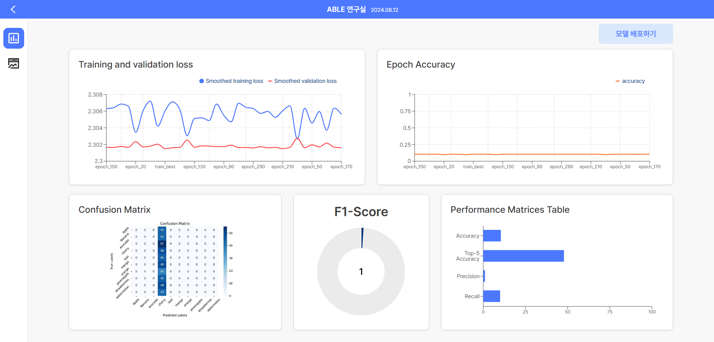

# 분석 결과

이 페이지에서는 학습시킨 모델의 성능 결과를 시각적으로 확인할 수 있습니다. 아래의 5가지 그래프와 표를 통해 모델의 학습 결과를 명확히 이해할 수 있습니다.

---

## 제공되는 그래프 및 표

1. **Training and Validation Loss 그래프**

   - 학습 및 검증 과정에서의 Loss 값을 확인할 수 있는 그래프입니다. 모델의 수렴 여부와 과적합 여부를 파악하는 데 도움을 줍니다.

2. **Accuracy 그래프**

   - 학습과 검증 단계에서의 정확도를 비교할 수 있는 그래프입니다. 모델의 전반적인 성능을 확인할 수 있습니다.

3. **Confusion Matrix 그래프**

   - 모델이 예측한 결과와 실제 값 간의 차이를 시각화합니다. 각 클래스의 정오분류를 확인할 수 있습니다.

4. **F1 Score 그래프**

   - F1 Score를 통해 모델의 정밀도와 재현율의 균형을 확인할 수 있습니다. 클래스 간의 성능 차이를 한눈에 볼 수 있습니다.

5. **Performance Matrices Table**
   - Precision, Recall, Top5-Accuracy, Accuracy 등 다양한 성능 지표를 표 형태로 제공합니다. 모델의 전반적인 성능 요약을 확인할 수 있습니다.

---

## 배포 기능

분석 결과 페이지에서는 학습된 모델을 배포할 수 있는 기능도 제공합니다. 배포는 다음 단계를 통해 이루어집니다:

1. **배포하기 버튼 클릭**

   - 페이지 내에서 [배포하기](../guide-deploy/deploy-api) 버튼을 클릭하면 모달 창이 열립니다.

2. **모달 창에서 배포 정보 입력**
   - **배포할 에포크 모델**: 사용자가 배포할 모델의 특정 에포크를 선택할 수 있습니다.
   - **API 경로**: 배포된 모델의 API 엔드포인트를 설정합니다.
   - **API 설명**: 배포된 API의 용도나 기능을 명시할 수 있습니다.

:::caution 주의

- API 경로는 반드시 `/`로 시작해야 합니다.
- 경로는 **소문자만** 사용해야 하며, 대문자는 사용할 수 없습니다.

:::

3. **배포 완료**

   - 모든 정보를 입력한 후 [배포하기](../guide-deploy/deploy-api) 버튼을 눌러 배포를 완료합니다. 배포된 모델은 프로젝트 결과에 따라 사용 가능합니다.

4. **배포 확인**
   - 서버 페이지에서 배포한 API 리스트를 확인할 수 있습니다. 자세한 내용은 [배포하기 페이지](../guide-deploy/deploy-api)에서 확인 가능합니다.

---

이 페이지는 모델의 학습 결과를 분석하고, 선택한 모델을 배포하여 실질적으로 활용할 수 있도록 설계되었습니다. 각 기능과 그래프는 AI 분석을 더욱 직관적이고 효율적으로 이해할 수 있도록 돕습니다.
